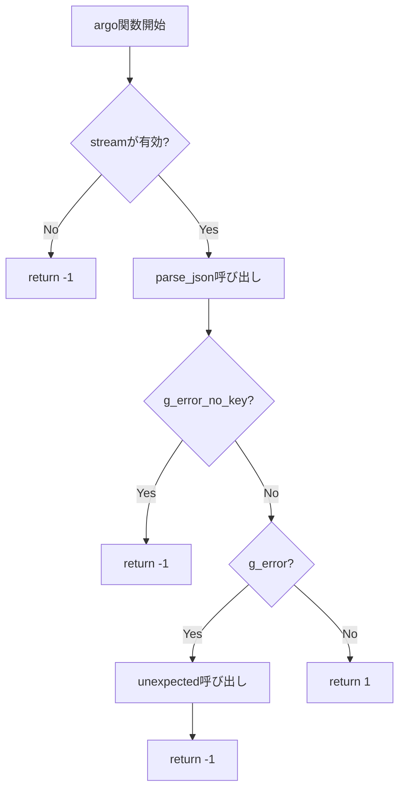
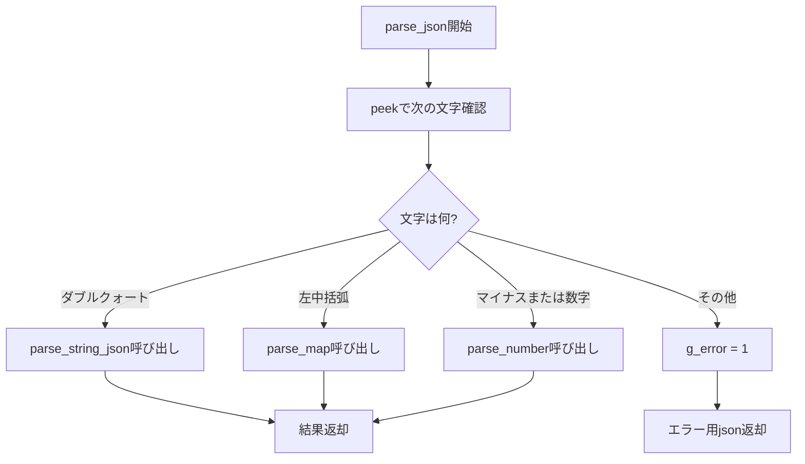
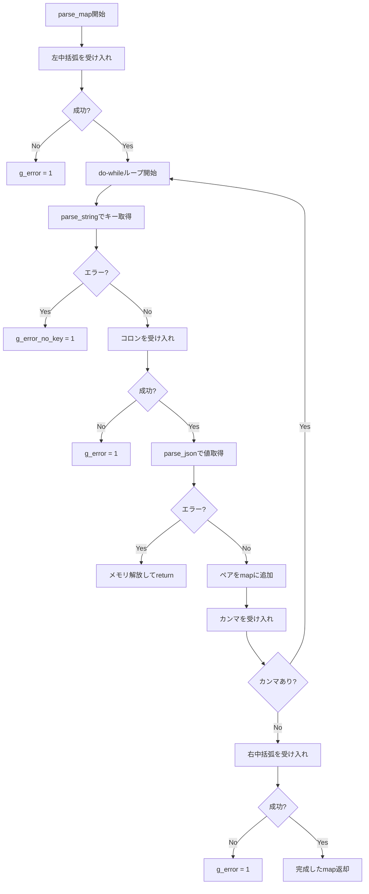
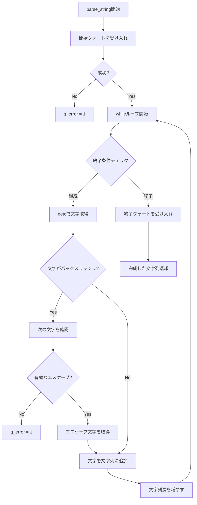
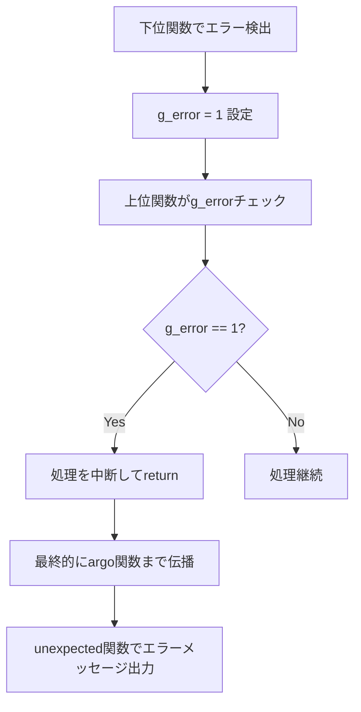

# argo.c と argo_utils.c の処理フロー解説

## 1. argo_utils.c のユーティリティ関数

### `peek(FILE *stream)` - 先読み関数
```c
int peek(FILE *stream)
{
    int c = getc(stream);
    ungetc(c, stream);
    return c;
}
```
- ストリームから1文字読み取り、すぐに戻す
- **消費せずに**次の文字を確認できる
- パーサーで「次に何が来るか」を判定するのに使用

### `accept(FILE *stream, char c)` - 条件付き消費
```c
int accept(FILE *stream, char c)
{
    if (peek(stream) == c)
    {
        (void)getc(stream);
        return 1;
    }
    return 0;
}
```
- 期待する文字`c`がストリームにあるかチェック
- あれば**消費**して1を返す
- なければ何もせず0を返す

### `expect(FILE *stream, char c)` - 必須文字の確認
```c
int expect(FILE *stream, char c)
{
    if (accept(stream, c))
        return 1;
    unexpected(stream);
    return 0;
}
```
- 期待する文字が**必ず**あるべき場面で使用
- なければエラーメッセージを出力

### `unexpected(FILE *stream)` - エラー出力
```c
void unexpected(FILE *stream)
{
    if (peek(stream) != EOF)
        printf("unexpected token '%c'\n", peek(stream));
    else
        printf("unexpected end of input\n");
}
```

## 2. argo.c の処理フロー

### メインエントリー: `argo()`
```c
int argo(json *dst, FILE *stream)
{
    if (!stream)
        return (-1);
    
    *dst = parse_json(stream);           // 1. JSONをパース
    if (g_error_no_key)                  // 2. キーエラーチェック
        return (-1);
    if (g_error)                         // 3. 一般エラーチェック
    {
        unexpected(stream);              // 4. エラーメッセージ出力
        return (-1);
    }
    return (1);
}
```

### 処理の振り分け: `parse_json()`
```c
json parse_json(FILE *stream)
{
    if (peek(stream) == '"')                    // 文字列
        return (parse_string_json(stream));
    if (peek(stream) == '{')                    // マップ
        return (parse_map(stream));
    if (peek(stream) == '-' || isdigit(peek(stream))) // 数値
        return (parse_number(stream));
    
    // エラー処理
    nothing.type = STRING;
    nothing.string = NULL;
    g_error = 1;
    return (nothing);
}
```

## 3. フローチャート

### メイン処理フロー


### parse_json 振り分けフロー


### parse_map 処理フロー


### parse_string 処理フロー


## 4. 具体的な処理例

### 例1: `{"key":"value"}` のパース
1. `argo()` が `parse_json()` を呼び出し
2. `parse_json()` が `peek()` で `'{'` を発見
3. `parse_map()` を呼び出し
4. `accept('{')` で `'{'` を消費
5. do-whileループ:
   - `parse_string()` で `"key"` をパース
   - `accept(':')` で `':'` を消費
   - `parse_json()` で `"value"` を再帰的にパース
   - `accept(',')` で `','` をチェック（なければループ終了）
6. `accept('}')` で `'}'` を消費
7. 完成したマップを返す

### 例2: `"hello\"world"` のパース
1. `parse_string()` 開始
2. `accept('"')` で開始の `'"'` を消費
3. whileループで文字を処理:
   - `'h'`, `'e'`, `'l'`, `'l'`, `'o'` を通常文字として追加
   - `'\'` を発見 → エスケープ処理
   - `peek()` で次の文字が `'"'` であることを確認
   - `'"'` を文字列に追加（エスケープ解除）
   - `'w'`, `'o'`, `'r'`, `'l'`, `'d'` を追加
4. `accept('"')` で終了の `'"'` を消費
5. 完成した文字列を返す

## 5. エラーハンドリングの仕組み

### グローバル変数によるエラー管理
- `g_error`: 一般的なパースエラー
- `g_error_no_key`: マップでキーが見つからないエラー

### エラー伝播フロー


この設計により、**再帰的なパース処理**と**統一されたエラーハンドリング**を実現しています。